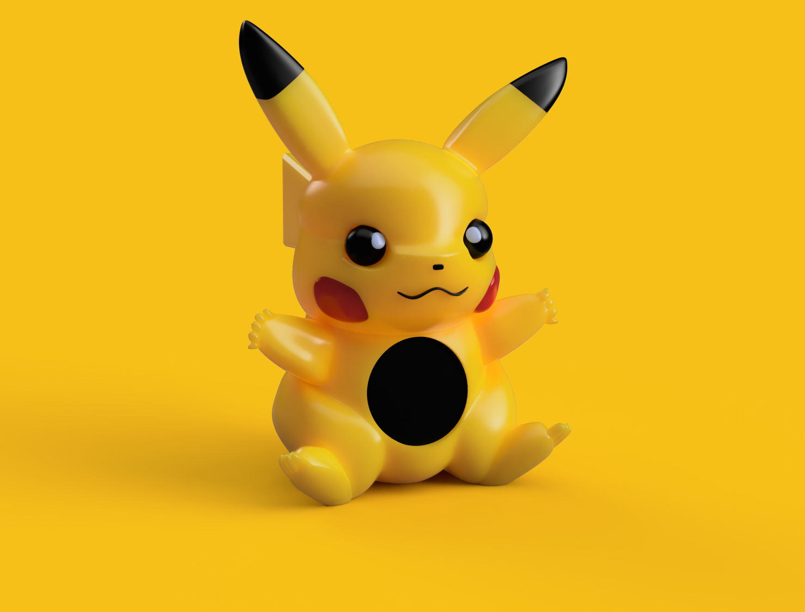

# PikaOS



A Pokémon-themed firmware for the **Waveshare ESP32-S3-Touch-AMOLED-1.75** — a 466×466 round AMOLED watch board with capacitive touch, an I²S audio codec, and a small speaker. Multiple watch faces, a timer, a stopwatch, a pet screen, settings, and hourly Pikachu chimes.

Built on Arduino-ESP32 + LVGL 8.3 + SquareLine-generated UI.

---

## Hardware

- **Board:** Waveshare ESP32-S3-Touch-AMOLED-1.75
- **Display:** 466×466 round AMOLED (CO5300 controller, QSPI)
- **Touch:** CST9217 capacitive (I²C)
- **Audio codec:** ES8311 (I²C control, I²S audio) driving a class-D PA on GPIO 46
- **MCU:** ESP32-S3 with PSRAM (used for the LVGL framebuffer)

---

## Features

### Watch faces & screens

Horizontally cycle (swipe left/right):

```
... ← Photo2 ← Pet → PokeBallAnalog → Screen1 → Analog → Photo → Photo2 → ...
```

| Screen           | Purpose                                                                  |
| ---------------- | ------------------------------------------------------------------------ |
| `PokeBallAnalog` | Themed analog clock drawn as a Pokéball with custom tick marks and hands |
| `Pet`            | Yellow background. Tap anywhere to play a random Pikachu sound effect    |
| `Screen1`        | Digital clock with date (12-hour format)                                 |
| `Analog`         | Plain analog clock face with a custom hour line                          |
| `Photo` / `Photo2` | Photo backgrounds with overlaid time/date                              |

Swipe **down** from `Analog` → `StopWatch`. Swipe **up** to return.
Swipe **down** from `Screen1` → `Timer`. Swipe **up** to return.
Swipe **up** from any clock face (PokeBallAnalog, Screen1, Analog, Photo, Photo2, Pet) → `Settings`.

### Timer

- Set countdown via the +/- buttons (±1 minute, ±1 second)
- Range 0:00 – 99:59
- **Start / Pause / End** buttons
- When the timer reaches `0:00` it triggers an audio alarm (`canon_pcm`) that loops until you press **End**.

### Stopwatch

- HH:MM:SS display
- Single play/pause button — icon toggles between `h` (play) and `g` (pause) using the custom Icons font
- Reset button clears elapsed time

### Pet

- Tap anywhere on the yellow screen → plays one of the registered Pikachu clips at random

### Hourly chimes

Settings → **Chimes** switch. When on, a random Pikachu clip plays at every hour rollover. Picks uniformly from the clips registered in `os/pikachu.h`.

### Auto-dim ("Dim" switch in Settings)

When enabled, the theme automatically switches:
- Dark theme between 20:00 and 06:00 (configurable via `DARK_START_HOUR` / `DARK_END_HOUR` in `os.ino`)
- Light/yellow theme the rest of the day

You can still override manually via the **Dark Mode** button; auto-dim will reassert on the next minute crossing.

### Settings

- **Brightness slider** — drives the display backlight (0–255)
- **Volume slider** — drives the ES8311 codec volume. The slider's `0–100` maps to codec `0–80` to prevent the small speaker from clipping at painful levels.
- **Dark Mode** button — manual toggle
- **Chimes** switch — enables the hour chime
- **Dim** switch — enables the auto-dim scheduler
- **Info** button — opens an info popup
- **WiFi** button — opens a popup to enter SSID + password and connect

### UI click feedback

Every clickable widget (button, switch, dropdown, list row, the Pet screen) plays a short synthetic click on tap. Implemented via LVGL's `indev_drv.feedback_cb` so it covers all widgets without per-button wiring. Background taps on non-clickable areas are ignored.

### WiFi + NTP

WiFi credentials are configured at the top of `os/os.ino`. On boot the device connects, then `configTime` syncs against `pool.ntp.org` (US Eastern timezone is hardcoded — see `setenv("TZ", ...)`).

---

## Audio system

Sounds are stored as C byte arrays (generated via `xxd -i some.wav > some.h`) and played through an `ES8311` codec at **16 kHz, 16-bit, mono**.

### Files

| File           | Contents                                                                  |
| -------------- | ------------------------------------------------------------------------- |
| `canon.h`      | Looping alarm sound for the Timer (Canon in D)                            |
| `pikachu1.h` … | Individual Pikachu clips. Add as many as you like.                        |
| `pikachu.h`    | Central registry — `#include`s each `pikachuN.h` and lists them in arrays |
| `click.h`      | Synthetic UI click — raw int16 samples, no header                         |

### Adding new pikachu clips

1. Record/find a short clip; in Audacity set Project Rate to **16000 Hz**, **Tracks → Resample → 16000**, then **Export Audio → WAV (16-bit signed PCM, Mono)**.
2. Convert to a header:
   ```
   cd os
   xxd -i pikachu4.wav > pikachu4.h
   ```
3. Edit `os/pikachu.h`:
   - Add `#include "pikachu4.h"`
   - Add `pikachu4_wav` and `pikachu4_wav_len` to the two arrays (`pikachu_clips[]`, `pikachu_clip_lens[]`)
4. `PIKACHU_CLIP_COUNT` is computed automatically from the array size.

### Why 16 kHz mono

The I²S peripheral is configured `I2S_MODE_STD`, `I2S_DATA_BIT_WIDTH_16BIT`, `I2S_SLOT_MODE_MONO` at 16 kHz so the byte rate exactly matches a mono 16-bit 16 kHz WAV (32 000 B/s). This avoids the channel-doubling weirdness that mono data in stereo mode causes, and keeps the codec's anti-alias filter at a useful 8 kHz cutoff for clear-sounding pikachu.

### WAV header handling

Files generated by `xxd -i` keep the 44-byte RIFF header at the start of the byte array. The audio task:
- Skips the first 44 bytes when writing to I²S (avoids the start-of-sound pop)
- Reads the `data` chunk size from bytes 40–43 so any trailing `LIST`/`INFO`/`ID3` chunks aren't played as garbage samples (avoids the end-of-sound pop)

---

## Project layout

```
os/
├── os.ino                   # Main sketch — setup, loop, UI event handlers
├── pin_config.h             # (from libraries/) hardware pin map
├── canon.h                  # Timer alarm sound
├── pikachu.h                # Pikachu clip registry
├── pikachu1.h, pikachu2.h…  # Individual pikachu clips
├── click.h                  # Synthetic UI click
├── es8311.{c,h}             # Audio codec driver
└── src/ui/                  # SquareLine-generated LVGL UI
    ├── ui.{c,h}             # ui_init / ui_destroy wiring
    ├── ui_PokeBallAnalog.{c,h}
    ├── ui_Screen1.{c,h}
    ├── ui_Analog.{c,h}
    ├── ui_Photo.{c,h}
    ├── ui_Photo2.{c,h}
    ├── ui_Timer.{c,h}
    ├── ui_StopWatch.{c,h}
    ├── ui_Settings.{c,h}
    ├── ui_Pet.{c,h}         # Hand-written (not from SquareLine)
    ├── ui_Alarm.{c,h}       # Generated but currently disabled (UI bug)
    └── fonts/, themes, helpers...
```

---

## Build & flash

### Requirements

- **Arduino IDE 2.x**
- **ESP32 board support** (esp32 ≥ 3.x)
- Board: select **ESP32S3 Dev Module**
- PSRAM: **OPI PSRAM**
- Partition scheme: **Huge APP (3MB No OTA / 1MB SPIFFS)** or similar with > 2 MB program space
- USB CDC On Boot: **Enabled**
- Flash Size: **16MB**

### Libraries

Place under `~/Documents/Arduino/libraries/`:

- `lvgl` (8.3.x)
- `Arduino_GFX` (fork that supports `CO5300`)
- `SensorLib` (`TouchDrvCSTXXX`)
- `ESP_I2S` (built into modern esp32 core)

Plus the project-local `Mylibrary/` for `pin_config.h`.

`lv_conf.h` should sit at the same level as the `lvgl` library folder (i.e., directly in `~/Documents/Arduino/libraries/`). Make sure the following fonts are enabled:

```c
#define LV_FONT_MONTSERRAT_14 1
#define LV_FONT_MONTSERRAT_20 1
#define LV_FONT_MONTSERRAT_24 1
#define LV_FONT_MONTSERRAT_28 1
```

(Required by the Settings and StopWatch screens.)

### Configuration

Edit the top of `os/os.ino` before flashing:

```cpp
const char* ssid     = "YOUR_SSID";
const char* password = "YOUR_PASSWORD";
```

If you're in a different timezone, change the `TZ` string in `setup()`.

### Build

Open `os/os.ino` in Arduino IDE → **Sketch → Upload**.

> **Note:** Do **not** open the parent `PikaOS/` directory as the sketch folder. Arduino IDE will recurse and trip on any reference materials sitting next to `os/`. Always open `os/os.ino` directly.

---

## Gestures cheat sheet

| From            | Swipe ↑    | Swipe ↓     | Swipe ←       | Swipe →           |
| --------------- | ---------- | ----------- | ------------- | ----------------- |
| PokeBallAnalog  | Settings   | —           | Screen1       | Pet               |
| Pet             | Settings   | —           | PokeBallAnalog| Photo2            |
| Screen1         | Settings   | Timer       | Analog        | PokeBallAnalog    |
| Analog          | Settings   | StopWatch   | Photo         | Screen1           |
| Photo           | Settings   | —           | Photo2        | Analog            |
| Photo2          | Settings   | —           | PokeBallAnalog| Photo             |
| Timer           | Screen1    | —           | —             | —                 |
| StopWatch       | Analog     | —           | —             | —                 |

Tap any UI element to interact; tap the Pet background for a random Pikachu sound.

---

## Known issues

- **Alarm screen disabled.** The SquareLine-generated `ui_Alarm` screen has a rendering bug where popup contents bleed onto other screens. `ui_Alarm.{c,h}` are kept to satisfy the linker, but `ui_Alarm_screen_init()` is not called and the down-swipe gesture from `Photo` is disabled. A hand-written replacement is the recommended path forward.
- **WiFi creds are hardcoded** in `os.ino` — there is also a runtime UI to enter them, but the boot-time values are still in the source. Scrub before publishing.

---

## Credits

- UI: built with [SquareLine Studio](https://squareline.io/) targeting LVGL 8.3
- Display + codec drivers: based on Waveshare's `ESP32-S3-Touch-AMOLED-1.75` reference examples
- Pokémon assets: fan art / public clips — used non-commercially
